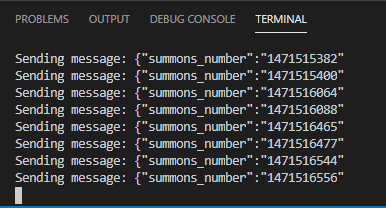
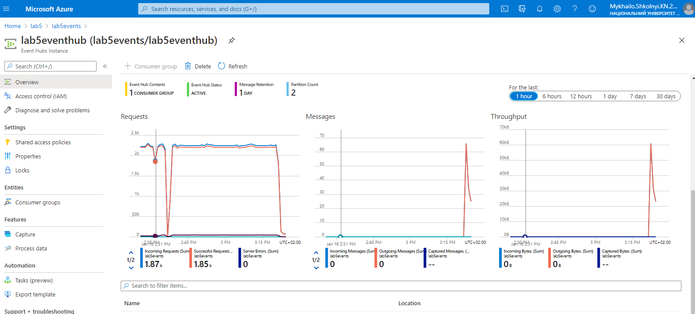

1. Create default resource group: 

2. Create default Azure Cache for Redis instance:

3. Create default Event Hubs namespace:

4. Create default Event Hubs instance:

5. Go back to namespace and create similar Shared Access Policy:

6. Go back to Event Hubs namespace and create similar Shared Access Policy:

7. Go to LoggerStrategy.ts and insert your Shared Access Policy connection string-primary key and Event Hub instance name to CONNECTION_STRING and EVENT_HUB_NAME variables.

8. Go to your Azure Cache for Redis Access Keys directory and insert the primary key to auth_pass variable in CacheService.ts. Also insert your Azure Cache for Redis host name to NAMESPACE variable.

9. Use "npm install" in terminal to install Node modules and skyfold .js files. Then use "npm start" to start the app.

10. Go to your Azure Cache for Redis console. Use "scan 0 count 100" command to check if your data is there and "flushall" to clear the cache: 

11. Go to your Even Hubs instance Overview to check if there any data incoming: 

