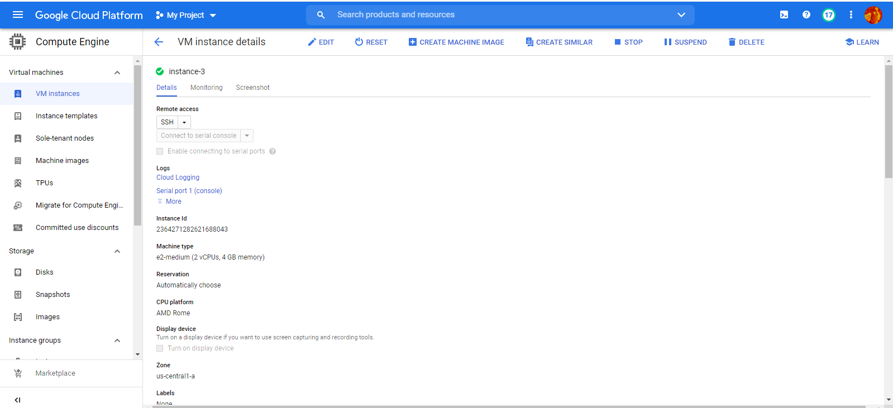
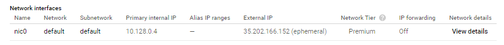
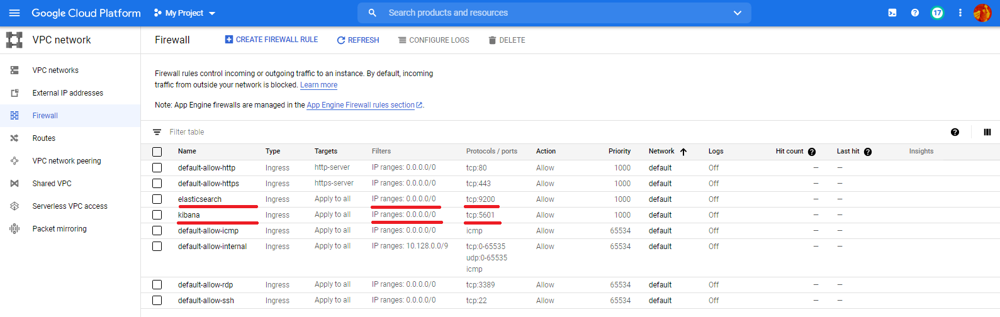
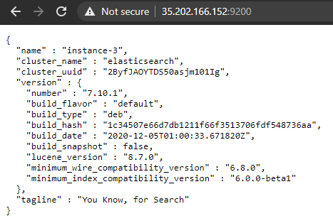
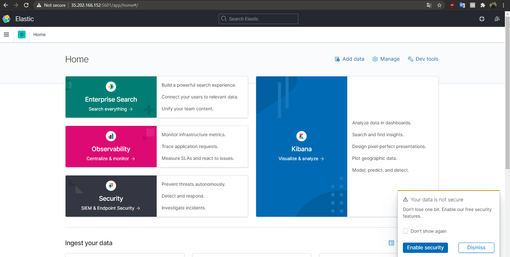
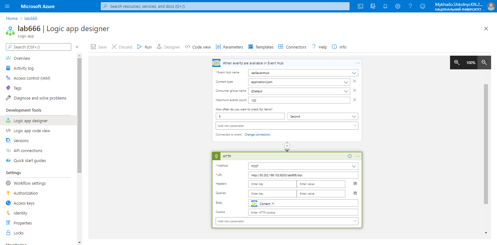
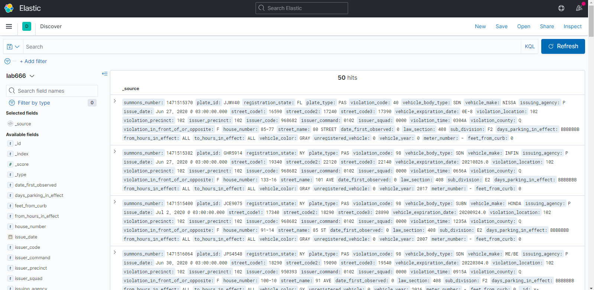

1. Create a Debian-based (actually you can use any Linux-based OS there, but in my case it's Debian. Some commands might need to be edited if you use another OS, though) VM instance in GCP, check "Allow HTTP" and "Allow HTTPS" traffic: 

2. Go to VM instance's overview > Network interfaces > Network details. Then create firewall rules for ElasticSearch and Kibana with preferences marked the second screenshot:

3. Connect to the instance through SSH. Then: 

    a) install ElasticSearch:
    `curl -fsSL https://artifacts.elastic.co/GPG-KEY-elasticsearch | sudo apt-key add -`

    `echo "deb https://artifacts.elastic.co/packages/7.x/apt stable main" | sudo tee -a /etc/apt/sources.list.d/elastic-7.x.list`

    `sudo apt update`

    `sudo apt install elasticsearch`

    b) to configure ElasticSearch use `sudo nano /etc/elasticsearch/elasticsearch.yml`. Uncomment network.host row and insert 0.0.0.0 address in it. Also uncomment the discovery.seed_hosts row. Then use `sudo service elasticsearch start` to make sure it's working.

    c) install Logstash: 

    `sudo apt-get install apt-transport-https`

    `echo "deb https://artifacts.elastic.co/packages/5.x/apt stable main" | sudo tee -a /etc/apt/sources.list.d/elastic-5.x.list`

    `sudo apt-get update`

    `sudo apt-get install logstash`

    `sudo service logstash start`

    d) install Kibana:

    `echo "deb http://packages.elastic.co/kibana/5.3/debian stable main" | sudo tee -a /etc/apt/sources.list.d/kibana-5.3.x.list`
    `sudo apt-get update`
    `sudo apt-get install kibana`
    `sudo vi /etc/kibana/kibana.yml`
    
    e) to configure Kibana use `sudo vi /etc/kibana/kibana.yml`. Uncomment and change server.host: “0.0.0.0” and server.port: 5601 rows. Then use `sudo service kibana start` to make sure it's working.

4. Go to https://YOUR_VM_INSTANCE_EXTERNAL_IP_HERE:9200 to make sure it's working: 

5. Go to https://YOUR_VM_INSTANCE_EXTERNAL_IP_HERE:5601 to access ElasticSearch web interface: 

6. Your ELK-stack is ready to go. Now you need to create a default Logic App  on Azure. Then go to Logic app designer and configure it like this: 

7. Run the app from lab5 to fire the App Logic triggers. Then go to Kibana > Discover and create Index Pattern with no time filter. Now you can see your data there: 

