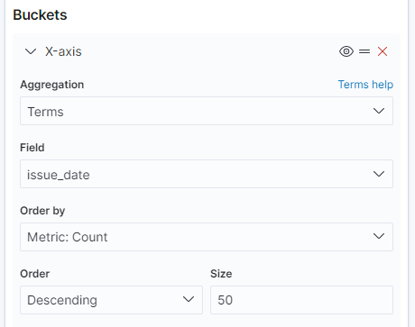

1. Go to Kibana > Visualize and create a Pie Chart visualization there. Then create an X-axis bucket and set it up like this:

2. Create a Line visualization. Then create an X-axis and Split series buckets and set it up like this: 

3. Go to Management > Dev Tools > Console and run this code: 

`
GET _search
{
"size": 0,
"aggs" : {
    "langs" : {
        "terms" : { "field" : "vehicle_make.keyword",  "size" : 3 }
    }
}}
`

