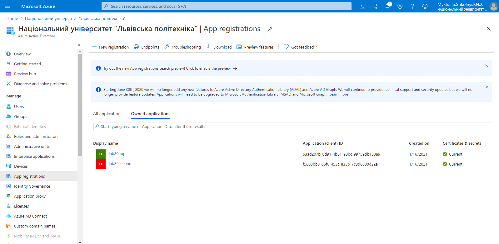

1. Create an Azure Databricks workspace using Trial Pricing Tear:


2. Press a Launch Workspace button, then go to Clusters and create a new cluster using 6.4 ML Runtime Version (newer versions won't work because for some reason the newest Eventhubs-Spark connector version can't be downloaded from Maven repository)


3. Start the cluster, then go to Libraries and install new library using these Maven coordinates: com.microsoft.azure:azure-eventhubs-spark_2.11:2.3.18:


4. Create a Storage account using LRS replication, StorageV2 account type and enabling the Hierarchical namespace option in the Advanced tab:


5. Go to Storage account > Containers and create a new container setting "public access level" to "container"


6. Go to Azure Active Directory > App registrations and create a new registration using default values. Then go to the application's Certificates & secrets tab and create a new client secret:




7. Go to Storage account > IAM and add a role assignment selecting your application as a member: 


8. Download Microsoft Azure Storage Explorer https://azure.microsoft.com/en-us/features/storage-explorer/. Log in with your Azure account, then go to Storage Accounts > YOUR STORAGE ACCOUNT NAME > Blob Containers > lab89container and create a new folder there:


9. Rightclick the container and click "Manage Access Control Lists" button, then add your registered app as an entity and give it read-write-execute permissions:


10. Now go to Databricks > Workspace > Users > YOUR USER and create notebooks for Scala and Python code: 


11. Fill the Scala notebook with this code (dont forget to change the variables): 

```
import org.apache.spark.eventhubs.{ ConnectionStringBuilder, EventHubsConf, EventPosition }
import org.apache.spark.sql.types._
import org.apache.spark.sql.functions._

val appID = "REGISTERED APP'S APPLICATION ID"
val password = "REGISTERED APP'S SECRET KEY VALUE"
val tenantID = "REGISTERED APP'S DIRECTORY ID"
val fileSystemName = "YOUR CONTAINER NAME"
val storageAccountName = "YOUR STORAGE ACCOUNT NAME"
val connectionString = ConnectionStringBuilder("YOUR EVENT HUBS FROM LAB 5 CONNECTION STRING")
  .setEventHubName("YOUR EVENT HUB INSTANCE NAME")
  .build
val eventHubsConf = EventHubsConf(connectionString)
  .setStartingPosition(EventPosition.fromEndOfStream)

var streamingInputDF = 
  spark.readStream
    .format("eventhubs")
    .options(eventHubsConf.toMap)
    .load()

val filtered = streamingInputDF.select (
  from_unixtime(col("enqueuedTime").cast(LongType)).alias("enqueuedTime")
     , get_json_object(col("body").cast(StringType), "$.issue_date").alias("issue_date")
     , get_json_object(col("body").cast(StringType), "$.vehicle_make").alias("vehicle_maker")
     , get_json_object(col("body").cast(StringType), "$.registration_state").alias("registration_state")
     , get_json_object(col("body").cast(StringType), "$.street_name").alias("street_name")
) //DONT FORGET TO CHANGE THESE VALUES IF YOU HAVE CHANGED THE DATASET

filtered.writeStream
  .format("com.databricks.spark.csv")
  .outputMode("append")
  .option("checkpointLocation", "/mnt/YOUR CONTAINER NAME/NAME OF THE FOLDER YOU CREATED")
  .start("/mnt/YOUR CONTAINER NAME/NAME OF THE FOLDER YOU CREATED")
```

12. Fill the Python notebook with this code (dont forget to change the variables):

```
configs = {"fs.azure.account.auth.type": "OAuth",
           "fs.azure.account.oauth.provider.type": "org.apache.hadoop.fs.azurebfs.oauth2.ClientCredsTokenProvider",
         "fs.azure.account.oauth2.client.id": "REGISTERED APP'S APPLICATION ID",
         "fs.azure.account.oauth2.client.secret": "REGISTERED APP'S SECRET VALUE",
         "fs.azure.account.oauth2.client.endpoint": "REGISTERED APP'S DIRECTORY ID",
         "fs.azure.createRemoteFileSystemDuringInitialization": "true"}
dbutils.fs.mount(
source = "abfss://YOUR_STORAGE_CONTAINER_NAME@YOUR_STORAGE_ACCOUNT_NAME.dfs.core.windows.net/",
mount_point = "/mnt/NAME OF THE FOLDER YOU CREATED",
extra_configs = configs)
display(dbutils.fs.ls('/mnt/NAME OF THE FOLDER YOU CREATED'))
```
13. Run Python code, then Scala. If everything is fine, data must be generating in a data lake: 


